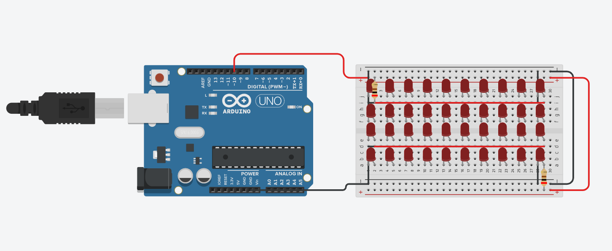

# TWINKLE LIGHTS

[](assets/video.gif)

## Project Description

This project involves an Arduino-controlled LED blinking system that uses a breadboard to power a set of 40 LEDs. The setup is connected through pin 10 of the Arduino board, which serves as the power supply to the breadboard. Each LED blinks at an interval of 200 milliseconds, creating a consistent rhythm that resembles a blinking light display.

## Components

- Arduino Uno
- ( 40 ) Red leds
- ( 2 ) 200Ω resistors
- Protoboard


> Project Status: concluded


## Installation Guide

### Arduino IDE

To build and upload this project to your Arduino board, you'll need the Arduino IDE. Here's a quick installation guide:

1. **Download**: Go to the [Arduino IDE download page](https://www.arduino.cc/en/software) and download the installer for your operating system.
2. **Install**: Follow the installation instructions for your OS. Make sure to allow the installation of drivers if prompted.
3. **Setup**: Open the Arduino IDE and go to `File > Preferences` to configure any additional settings if needed.
4. **Add Board**: If you are using a board that requires additional configuration, go to `Tools > Board > Boards Manager` and install the necessary packages.

### Git

To manage version control and clone repositories, you'll need Git. Here's a quick installation guide:

1. **Download**: Visit the [Git website](https://git-scm.com/) and download the appropriate installer for your operating system.
2. **Install**: Run the installer and follow the setup instructions. You can choose the default options for most settings.
3. **Verify**: Open a terminal or command prompt and type `git --version` to ensure Git is installed correctly.

## Cloning the Repository

To clone this repository to your local machine, follow these steps:

1. **Open Terminal**: Open a terminal or command prompt on your machine.
2. **Clone Repository**: Use the following command to clone the repository:

   ```bash
   git clone https://github.com/yourusername/your-repository-name.git


## License

This project is licensed under the [MIT License/your chosen license]. You can find a copy of the license in the `LICENSE` file. 

### License Summary

- **Permission**: You are free to use, copy, modify, merge, publish, distribute, sublicense, and/or sell copies of the Software.
- **Conditions**: The above copyright notice and this permission notice must be included in all copies or substantial portions of the Software.
- **Disclaimer**: The software is provided "as is", without warranty of any kind. 

For more details, please refer to the full text of the license in the `LICENSE` file.   

## Contacts

📧 henriquemelo0983@gmail.com

💼 LinkedIn: [Henrique Melo](https://www.linkedin.com/in/henrique-de-oliveira-melo-933a41203/)